## 一、插件简介

百变天依的四重奏！全新WordPress Live2d插件，支持4款天依新旧模型自由切换、后台可视化样式自定义、交互文本修改和一言设置。

左下角现已实装新版插件，用pc打开[网页](https://www.luotianyi.blue/newluotianyi-live2d)，试试效果吧。

## 二、**下载**地址

[Releases](https://github.com/HuxiaoRoar/NewLuotianyi-Live2D/releases)

[百度网盘](https://pan.baidu.com/s/1lqut1FjqI00yq3hCT0puLQ?pwd=0712)

[蓝奏云](https://huxiaoroar.lanzouu.com/b01gi5i7da) 提取码7et9

**最新版本：v1.0**

## 三、版本更新

### v1.0（2026-7-23）

Live2d官方认定本插件不属于可扩展应用，版权使用sdk。现在插件无需任何操作，直接下载插件上传wp即可。

### v1.0 Beta（2026-7-12）

    

本次改动围绕前台、后台两部分。从天堂菌大佬的[插件](https://cn.wordpress.org/plugins/live-2d/)汲取了大量灵感。

#### 后台

#### 1、更详细全面的设置面板

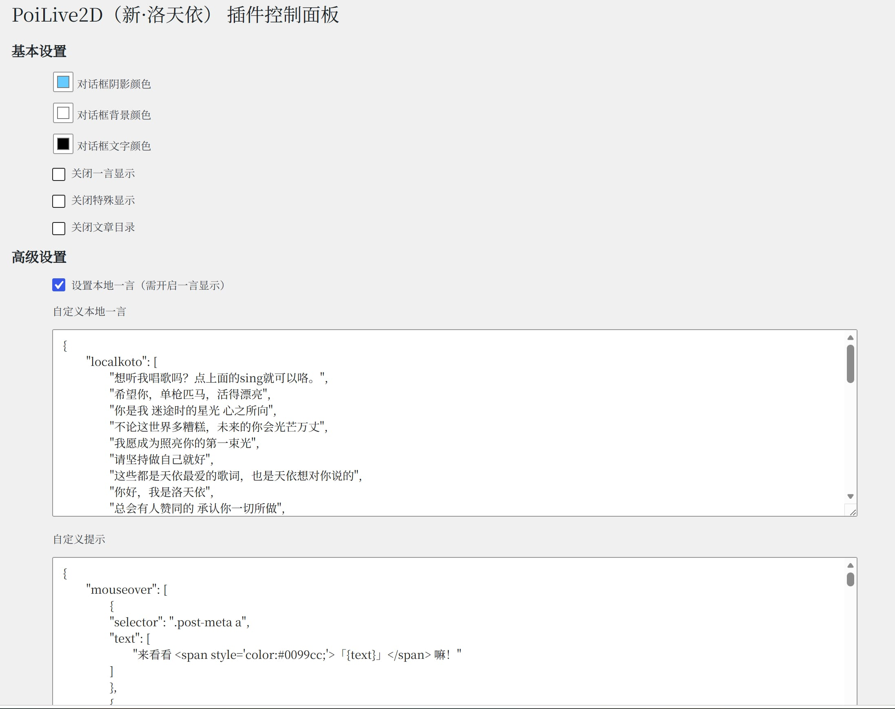

之前只能修改部分组件的颜色以及为数不多的开关选项，一言和交互文本相关内容还只能通过编辑 json 文件修改。

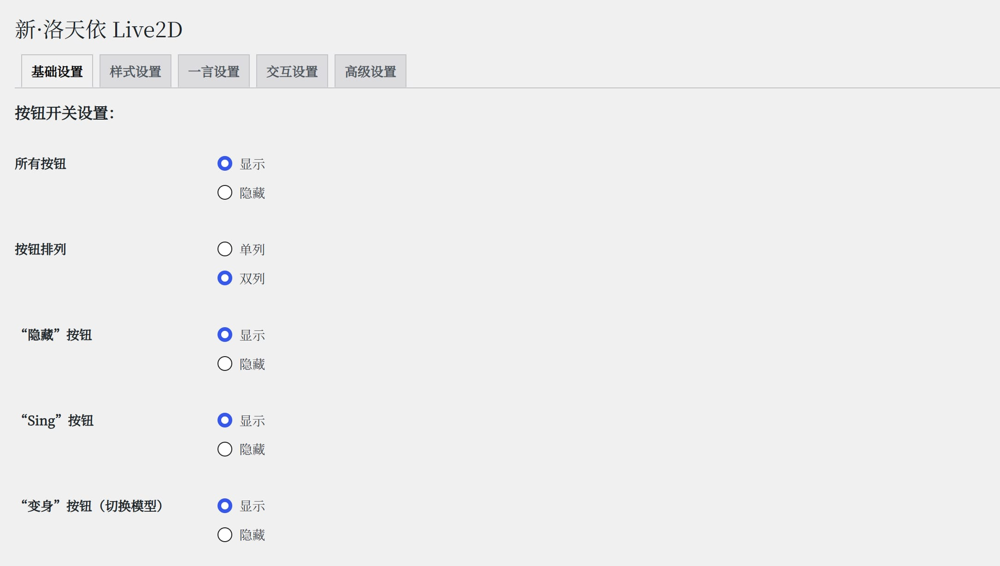

将设置选项按类别分成后台多个标签，便于可视化操作，可设置的内容也更加细致全面，设置页面可按ctrl+s快捷保存设置。

具体可设置内容，欢迎各位自己下载查看，也会在前台那边说明。

#### 2、新增配置文件导入、导出

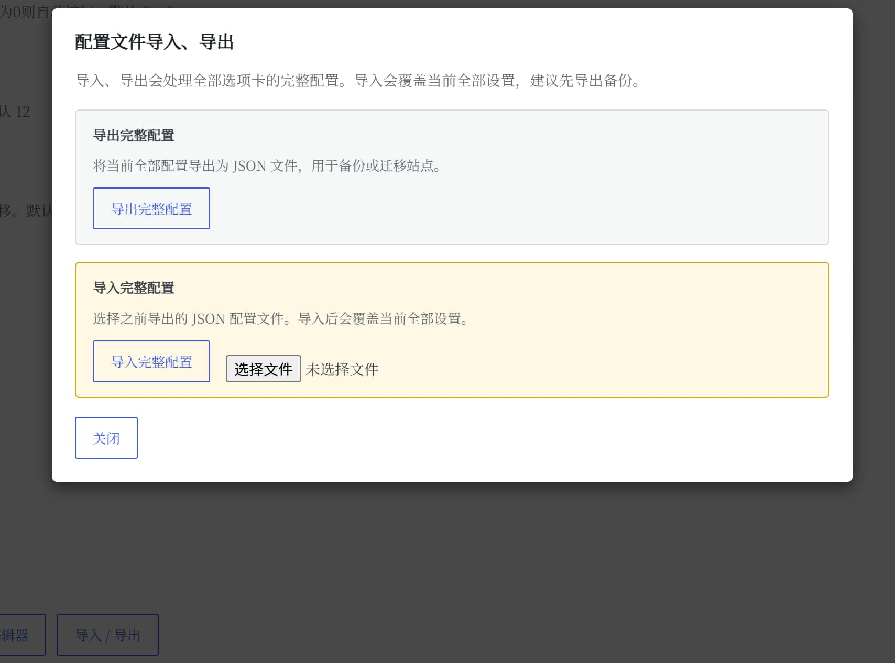

方便设置的备份和迁移。

#### 3、新增JSON 源码编辑器

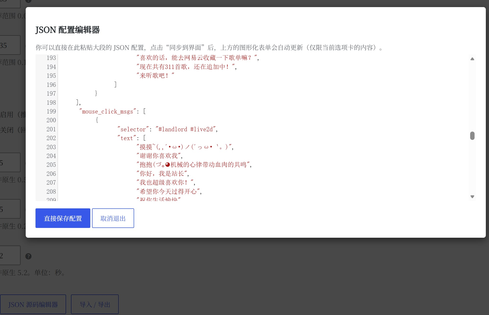

直接编辑当前设置页的json文件，便于批量文本操作和从老版本迁移。

#### 4、新增样式改动实时预览

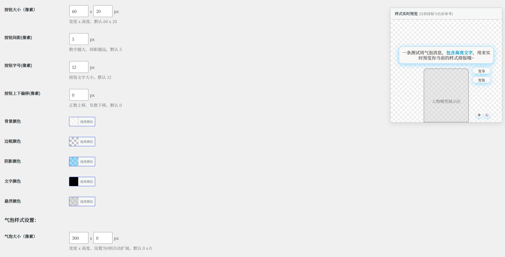

再也不用后台改参，前台反复刷新，后台实时预览各项参数，包括按钮气泡的大小，字号，颜色，位置偏移量。

#### 5、一言的大改动

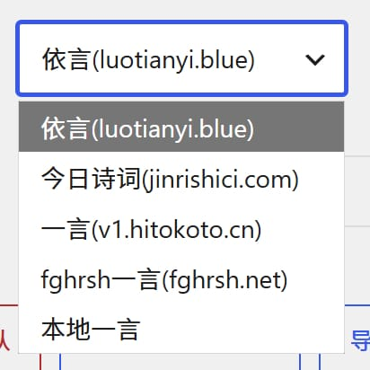

新增更多一言API可供选择；

新增一言触发间隔时间设定；

今日诗词可选择开关个性化推荐；

自建洛天依歌词相关一言API“[依言](https://www.luotianyi.blue/API/yiyan)”（不知道我能不能顶得住.jpg，这部分或许未来还会有额外展开）；

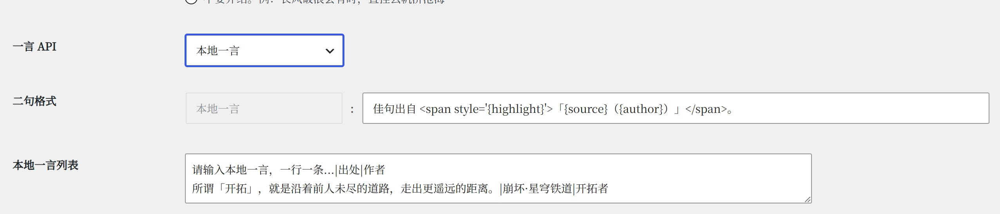

新增本地一言文本框编辑，可用“一言|出处|作者”的格式，注明每句由来。

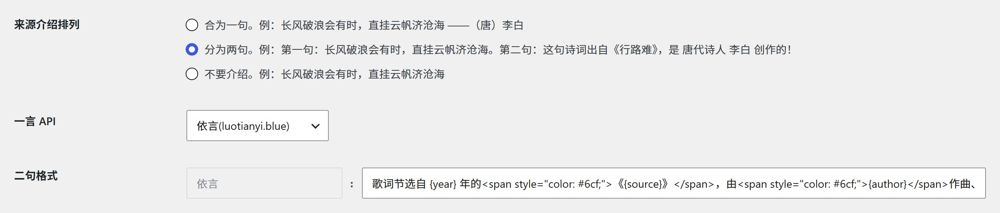

新增介绍方法的选择和格式设定，支持占位符。当前网站介绍方式为分为两句，格式为`歌词节选自 {year} 年的《{source}》，由{author}作曲、{lyricist}作词！`

#### 6、主动交互文本的改动

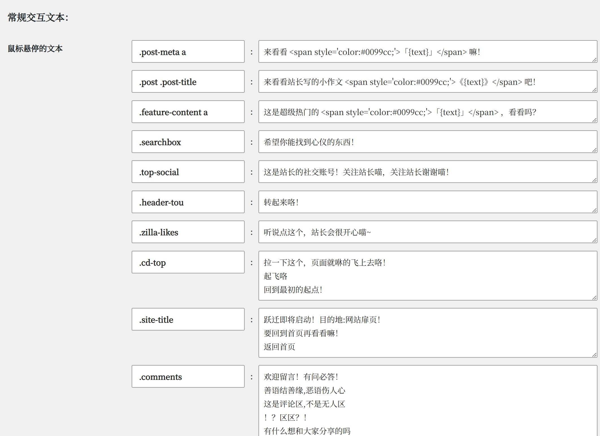

更直观的交互文本设置。

左侧是jQuery选择器的目标，右侧是交互文本，一行一条，触发后随机抽选。

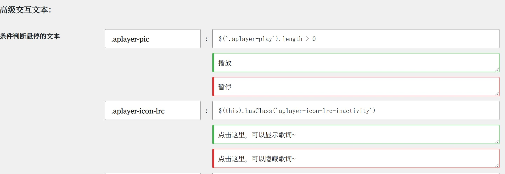

比如区分播放暂停、歌词开关的状态。

#### 7、被动交互文本的改动

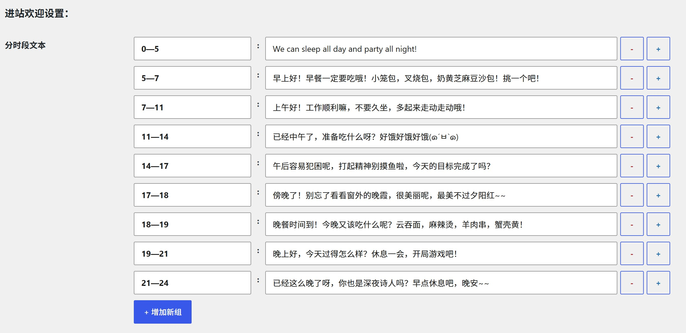

新增后台直接编辑，无需修改 JS 文件，涉及“复制提示，显隐提示，进出网页提示，节日祝福，进站欢迎，时段播报。”一行一条，触发后随机抽选；

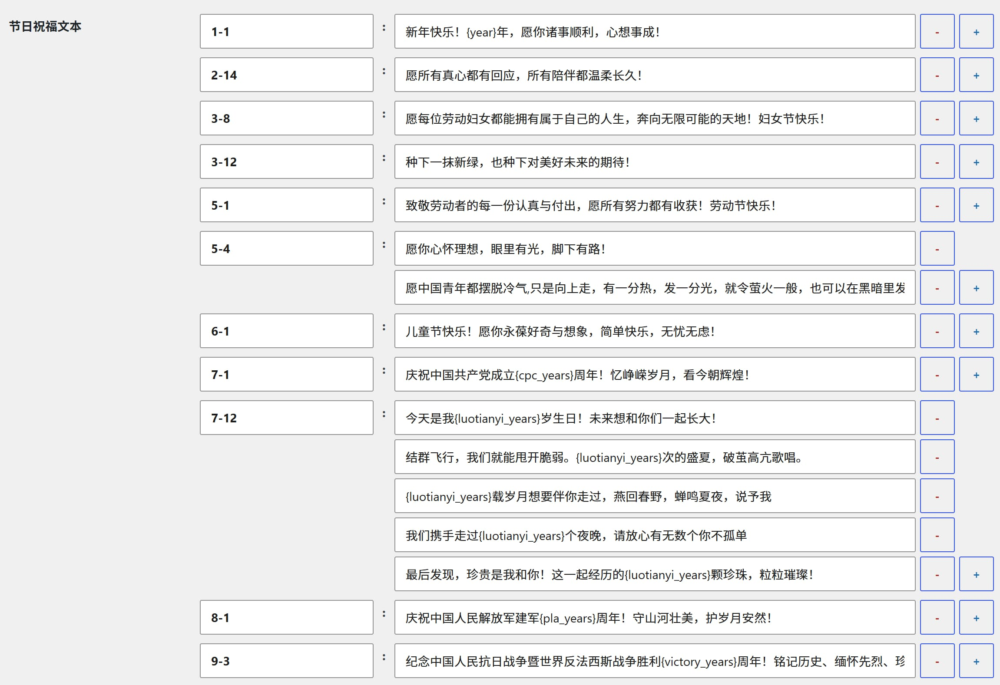

新增节日祝福的周年占位符。

#### 前台

#### 1、新增支持新版模型

核心改动。使用Pixi作为渲染引擎，再通过live2d-display插件，实现支持新版Live2d moc3模型。支持新模型切换“贴图”。

*新模型的换装，实际是切换为同文件夹内的另一个模型文件，不再是更换贴图文件。天依的3个新模型都没有第二套衣服可换，但功能已实现。*

重新计算画布缩放，让老模型也能更加清楚。

虽然初版就做了切换的按钮，但奈何彼时天依新模型都只有一个，更别提早已退出舞台的 Moc 老模型。最终所谓切换，也就是在原版 PIO 和 天依换皮 PIO 之间来回更换。那时又没有两位G老师，我也不知道怎么去支持新版本，就一直搁置。

#### 2、新增模型位置调整

新增微调面板，可以控制模型的 X Y 轴偏移和缩放。也可以直接按住 Shift 直接拖动模型，滚轮放大缩小模型。

此处只是改变模型在组件里的位置，适配不同尺寸的天依模型。改变组件位置和大小在下文。

#### 3、新增模型交互

新增模型点击、拖拽交互，可正常播放动作，音频以及内置交互文本。

针对小老虎模型，可点击的区域有手，头，脸，身体等；针对小洛模型，可点击的区域有∞，耳机，辫子末端，刘海，中国结等，可自行尝试。

#### 4、新增模型、贴图切换逻辑

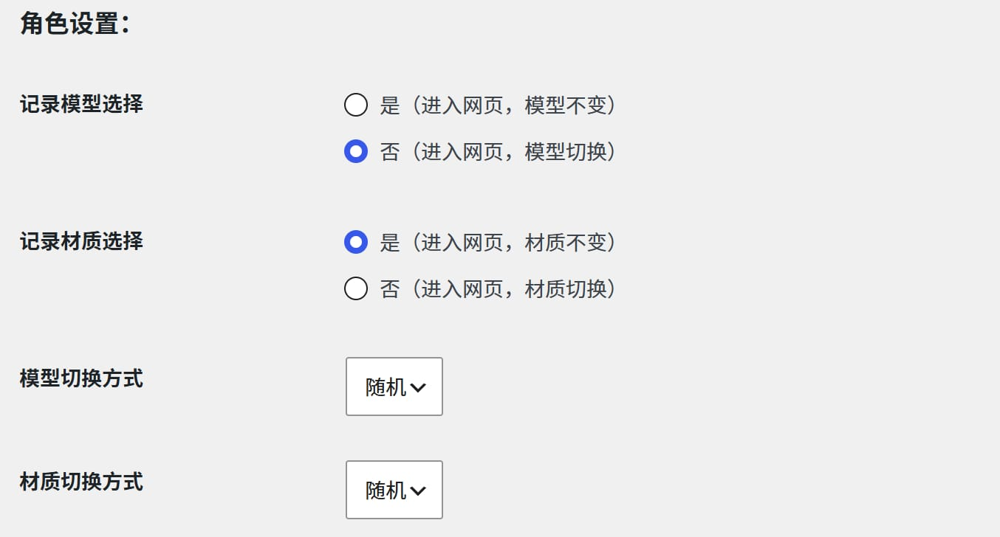

可选择随机、顺序的切换方式；可选择记忆的模型、贴图，下次进入网页保持不变。

#### 5、新增自由拖拽

新增拖拽手柄，可以拖动模型，拖拖看吧。

当前网站实际使用模式为自由拖拽 - 松手复原。

如果选择松手固定并开启记录拖拽位置，那么下次进入网页时，组件将依然保持在该位置，优先级高于下面的自定义。

#### 6、新增组件样式

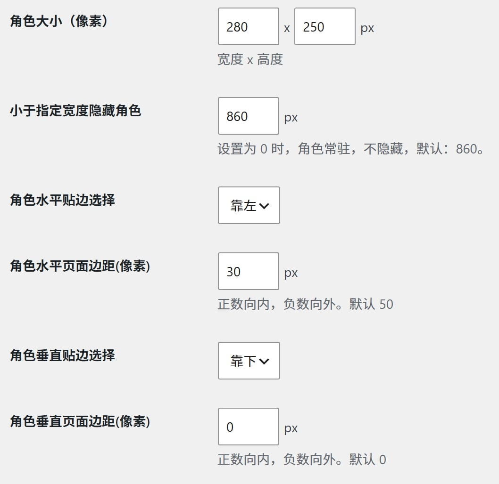

组件大小设置、隐藏触发距离数值设置、水平、垂直贴边选择、间距距离设置-变相决定组件位置。

#### 7、新增自定义按钮

现在可以设置按钮的更多内容：控制每个按钮的显隐，选择按钮的单列或双列分布，选择单列布局靠左或靠右，修改按钮的样式（颜色、字号、位置、行间隔）。气泡能修改的样式同理。

#### 8、气泡抖动的优化

过去气泡抖动由CSS的固定动画实现，抖动路径方向完全一致。现在改为 JS 随机生成。

#### 9、Sing列表的改动

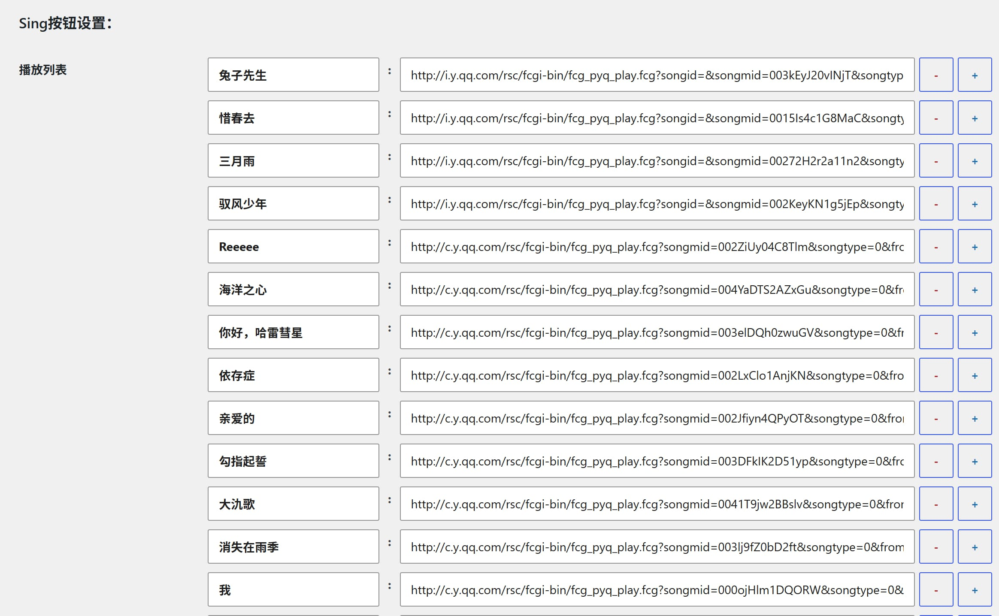

从 json 文件集成到设置后台，方便修改链接，添加新歌。

#### 10、优化视线的鼠标追踪效果

将视线追踪的计算改为物理弹簧模拟，同时使用n次指数递减，让角色中心权重更高，追踪偏移更明显。

#### 11、优化动作文件，防止卡死

当动作文件未标明渐入渐出时间，系统会采用默认值的1s，倘若动作持续时间过短少于1s，就会导致动作还没做完就卡住不动，针对这种情况，现在会根据动作文件运动节点时间，计算出合理渐入渐出时间，并写入动作文件，顶替默认值。

#### 12、优化呼吸

针对LPK文件，重新计算呼吸，加入改参，不涉及标准模型文件。

## 四、Q&A 

### Q0.怎么使用？

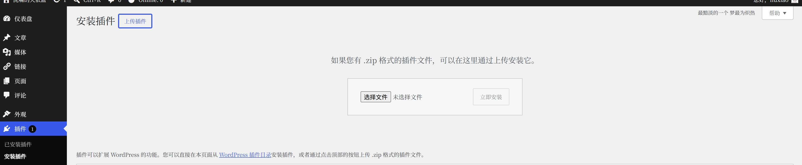

1.  下载压缩包
2.  可通过wp后台或者解压到插件目录来安装插件。

### Q1.我可以更换模型吗？怎么更换？

本插件设计初衷只为实现天依的live2d，故后台设置里没有设计上传模型的接口，模型文件在路径`“NLTY-Live2d\live2d\model\”`下。虽说调试期间，测试了多种途径的各类模型，各种功能均正常，但插件核心理念不是对多模型的广域适配，所以不做“其他模型一定能用，绝对不出问题”的承诺。

### Q2.和wp插件商店里的live2d插件有什么区别？我该如何选择？

我学天堂菌的，很多设置选项的设立都参考了他的思路。他的插件基于 Live2D Cubism 4 SDK for Web R5 Canvas 渲染 + IndexedDB 缓存，加载更流畅，后台直接就能上传新模型，还能接入GPT 接口，实现ai对话。

作者代码能力更不用说，相形见绌，我全靠AI。他更新更频繁，后续维护好，能得到更稳定更好的服务。我看最近的更新日志，甚至会为特定某类的模型做优化，对多模型的适配更好，而且新增模型的防盗链方案，防止别人盗用你的专属模型。

如果你有频繁更换添加模型的需求，对模型有安全需求，我强烈推荐他的[插件](https://cn.wordpress.org/plugins/live-2d/)。如果你只想看看天依，那新洛天依Live2D应该能复刻七七八八的效果，大差不差。

### Q3.去哪反馈问题？

专栏评论区、私信、github提交issue，欢迎多多反馈。

## 五、版权声明

本插件基于live2d，为无盈利免费插件。经历众人插件，迭代修改而来，本插件与原插件均遵循GPLv2协议开源。

开源内容不包含模型文件和Live2D SDK。洛天依版权归属上海禾念，模型版权归属原作者，Live2D SDK版权归属Live2D公司。

## 六、更新计划

*   节假日支持中国传统节日、农历节日
*   README.md
*   优化文件架构
*   尝试适配手机
*   加载缓慢问题
*   自己做个live2d
*   ……

## 七、鸣谢

*   **PoiLive2D 原版** (v1.06) —— 作者：[戴兜](https://daidr.me/) \[ [说明&下载页](https://daidr.me/archives/code-176.html) \]
*   **PoiLive2D 洛天依版** (v1.10) —— 作者：[unsigned](https://unsignedzhang.cn/) \[ [说明&下载页](https://unsignedzhang.cn/luotianyi-live2d/) \]
*   **PoiLive2D 魔改版** (v0.9.A) —— 作者：[电波万事屋](https://omega.im/63/) \[ [说明&下载页](https://www.omega.im/63/) \]
*   **Live 2D** (v2.2.0) —— 作者：[天堂菌](https://github.com/jiangweifang) \[ [说明&下载页](https://www.live2dweb.com/) \]
*   **Live2D SDK** —— 作者：[Live2D公司](https://www.live2d.com/)
*   **小洛** —— 作者：[火爆鸡王](https://www.bilibili.com/video/BV1Bk88eDEoK)
*   **洛天依小老虎【LD】** —— 作者：[最后的梦制作组](https://www.bilibili.com/video/BV1yL4y1u7FB) | 画师：[TID](https://space.bilibili.com/1329489/)
*   **豆丁洛天依** —— 作者：[茶眠](https://space.bilibili.com/104345729)
*   **最好的老师：Gemini&GPT**

